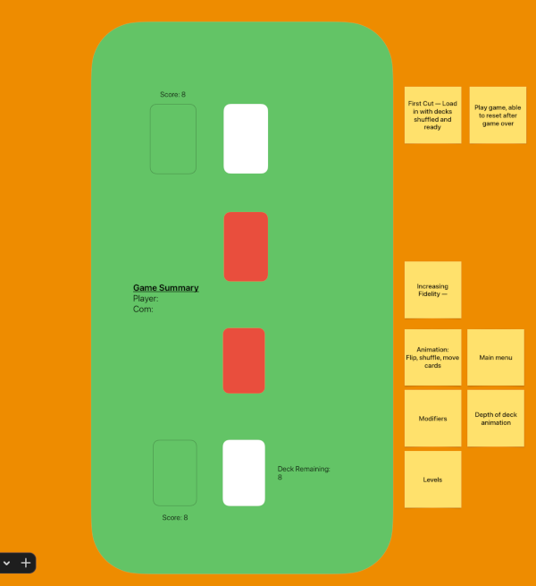

# Free-Form

# Transcription

## First-Cut
- Load in with decks shuffled and ready
- Play the game, reset after game over
- Count stats -- # wins, remaining deck, score

## Increasing Fidelity 
- Animations
	- Flip cards, shuffle cards, move cards 
- Main Menu
- Modifiers to "spice" up game
- Depth of deck visual wrt no. cards remaining
- Levels 

## "Story" / Pre-Match Modifiers
- Sticking with the game theme "War" -- Maybe the player selects a state in a tumultuous time; 
but hilariously all physical violence is settled via this card game.
- Goal of the game is USA domination?
- Fighting on home-land increases rank +1
- State deck sizes aren't necessarily even 
- State may have baked in modifier -- PA, Hearts rank +1 for instance  

## In-Match Modifiers
- What makes the game fun to play while you are playing it?
