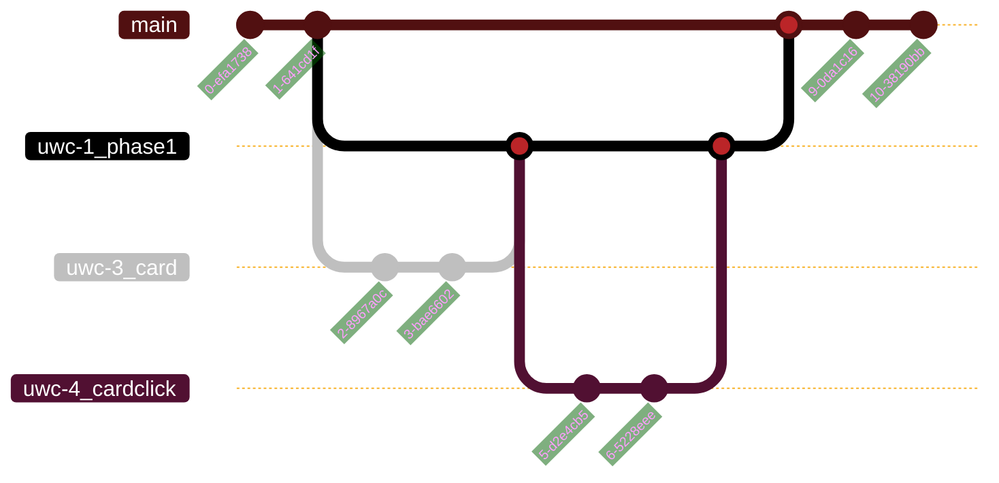

- For getting started, we're going to make feature branches off slightly longer lived 'phase' branches (see [planning](planning.md))
- Branch names will follow the following criteria:
	- Phase branches: \<JiraTag>_\<shortname>
	- Feature branches: \<JiraTag>_\<shortname>

